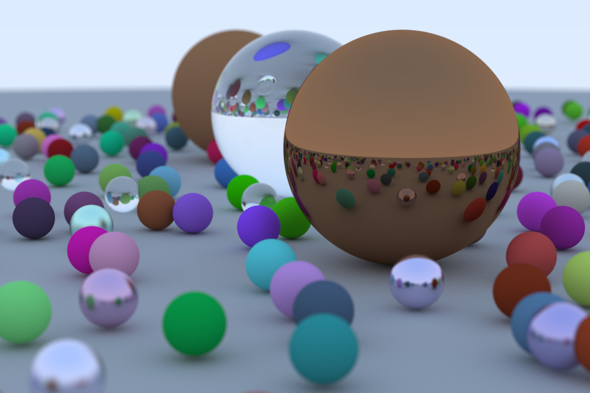
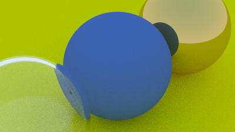

# Rusty Ray Tracer
by Cameron Christensen - Fall 2021

## Running

The parameters... are actually all currently at the top of main.rs. :)

## Images

Please see `journal` for more images illustrating its development.

## Story

I started this both to brush up on ray tracing and to learn Rust.

For the former I've been (for the first time) following Peter Shirley's [_Ray Tracing in One Weekend_](https://raytracing.github.io/books/RayTracingInOneWeekend.html). I took his class awhile back* and fell in love with ray tracing, and took [Cem Yuksel's class](https://graphics.cs.utah.edu/courses/cs6620/fall2013) at the University of Utah a bit later**, and now here I am, finally pursuing my dreams, but with a bit of professional experience under my belt to share.
\*1999, \*\*2013

For the latter, I was inspired to try by [Will Usher's](https://www.willusher.io) admiration for the language, and it's been delightful. I've started with the [The Rust Programming Language](https://doc.rust-lang.org/stable/book/) book, skipping around a bit since they teach **Traits** a little late, and at some point my code had grown large enough to need modularizing.

I go back and forth between learning new aspects of the language and re-awakening to the art of image synthesis. I try to follow Peter's (and many other authors') advice to just sit down and work, but sometimes solving problems and having inspiration come on those bike rides, walks, and... well, I guess that's it--between coding and sleep.
It's overwhelming to realize how much there is to learn, but comforting to know I'll never have to stop. Well, I guess at some point, but... well, maybe I'll get a sticker or something that says *Ray trace till I die!*

One of the other things I'm starting to learn on the side is Vulkan, and there's a Rust library for this. It's somewhere near the top of my list to try it out.

Please keep in mind this is my _very first_ Rust app. The todo list is long and fraught with peril (I just wanted to say that). My creative spirit and professional organization hopefully permeate this. One of the ways I've enjoyed going back through the code is commit by commit--someone could probably make a Processing sketch for this--and I have a journal directory for every phase of the project. Sometimes I cleanup, other times I add something. I've so far intentionally avoided looking at [other](https://github.com/CircArgs/ray-tracer-weekend) [RTiOW ray tracers](https://github.com/nya3jp/raytracing) [built](https://github.com/takahirox/wgpu-rust-renderer) [with Rust](https://github.com/Twinklebear/tray_rust), since I want to [re-]learn and trying is one of the best ways to do so, but pretty soon I'll take a peek to see the way others implement things.

Thanks!

*I didn't realize when I came up with it that my ray tracer name might be familiar to some of us sparker fans already, but if you think about it, rtrt is probably pretty rusty by now as well, so...

## TODO

_neverending lists of the desired, practical or otherwise_

- [ ] Ensure Jumbles' coordinate systems correctly invert normals 
- [ ] Add Vulkan Rust module for interactivity
- [ ] put lots of options in a UI (the simple one everyone uses for OpenGL stuff)
- [ ] make some bouncy spheres using squishy Jumbles

## P.S.

Normally I wouldn't commit "journal" pics, but I like the way it further illustrates my development/debugging process, which is one of the sub-goals of writing this. I'll extract the source without these pics into a fresh repo soon and find a better place to store them.
